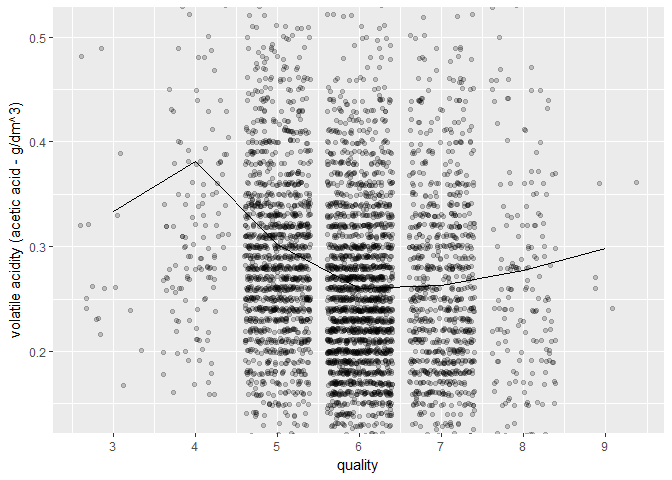

Wine Quality Analysis by Dara Jin
========================================================


Dataset can be downloaded [here](https://s3.amazonaws.com/udacity-hosted-downloads/ud651/wineQualityWhites.csv).

Paulo Cortez (Univ. Minho), Antonio Cerdeira, Fernando Almeida, Telmo Matos and Jose Reis (CVRVV) @ 2009
   
P. Cortez, A. Cerdeira, F. Almeida, T. Matos and J. Reis. 
Modeling wine preferences by data mining from physicochemical properties.
In Decision Support Systems, Elsevier, 47(4):547-553. ISSN: 0167-9236.


# Univariate Plots Section

```
## [1] 4898   13
```

```
##  [1] "X"                    "fixed.acidity"        "volatile.acidity"    
##  [4] "citric.acid"          "residual.sugar"       "chlorides"           
##  [7] "free.sulfur.dioxide"  "total.sulfur.dioxide" "density"             
## [10] "pH"                   "sulphates"            "alcohol"             
## [13] "quality"
```

```
## 'data.frame':	4898 obs. of  13 variables:
##  $ X                   : int  1 2 3 4 5 6 7 8 9 10 ...
##  $ fixed.acidity       : num  7 6.3 8.1 7.2 7.2 8.1 6.2 7 6.3 8.1 ...
##  $ volatile.acidity    : num  0.27 0.3 0.28 0.23 0.23 0.28 0.32 0.27 0.3 0.22 ...
##  $ citric.acid         : num  0.36 0.34 0.4 0.32 0.32 0.4 0.16 0.36 0.34 0.43 ...
##  $ residual.sugar      : num  20.7 1.6 6.9 8.5 8.5 6.9 7 20.7 1.6 1.5 ...
##  $ chlorides           : num  0.045 0.049 0.05 0.058 0.058 0.05 0.045 0.045 0.049 0.044 ...
##  $ free.sulfur.dioxide : num  45 14 30 47 47 30 30 45 14 28 ...
##  $ total.sulfur.dioxide: num  170 132 97 186 186 97 136 170 132 129 ...
##  $ density             : num  1.001 0.994 0.995 0.996 0.996 ...
##  $ pH                  : num  3 3.3 3.26 3.19 3.19 3.26 3.18 3 3.3 3.22 ...
##  $ sulphates           : num  0.45 0.49 0.44 0.4 0.4 0.44 0.47 0.45 0.49 0.45 ...
##  $ alcohol             : num  8.8 9.5 10.1 9.9 9.9 10.1 9.6 8.8 9.5 11 ...
##  $ quality             : int  6 6 6 6 6 6 6 6 6 6 ...
```

```
##        X        fixed.acidity    volatile.acidity  citric.acid    
##  Min.   :   1   Min.   : 3.800   Min.   :0.0800   Min.   :0.0000  
##  1st Qu.:1225   1st Qu.: 6.300   1st Qu.:0.2100   1st Qu.:0.2700  
##  Median :2450   Median : 6.800   Median :0.2600   Median :0.3200  
##  Mean   :2450   Mean   : 6.855   Mean   :0.2782   Mean   :0.3342  
##  3rd Qu.:3674   3rd Qu.: 7.300   3rd Qu.:0.3200   3rd Qu.:0.3900  
##  Max.   :4898   Max.   :14.200   Max.   :1.1000   Max.   :1.6600  
##  residual.sugar     chlorides       free.sulfur.dioxide
##  Min.   : 0.600   Min.   :0.00900   Min.   :  2.00     
##  1st Qu.: 1.700   1st Qu.:0.03600   1st Qu.: 23.00     
##  Median : 5.200   Median :0.04300   Median : 34.00     
##  Mean   : 6.391   Mean   :0.04577   Mean   : 35.31     
##  3rd Qu.: 9.900   3rd Qu.:0.05000   3rd Qu.: 46.00     
##  Max.   :65.800   Max.   :0.34600   Max.   :289.00     
##  total.sulfur.dioxide    density             pH          sulphates     
##  Min.   :  9.0        Min.   :0.9871   Min.   :2.720   Min.   :0.2200  
##  1st Qu.:108.0        1st Qu.:0.9917   1st Qu.:3.090   1st Qu.:0.4100  
##  Median :134.0        Median :0.9937   Median :3.180   Median :0.4700  
##  Mean   :138.4        Mean   :0.9940   Mean   :3.188   Mean   :0.4898  
##  3rd Qu.:167.0        3rd Qu.:0.9961   3rd Qu.:3.280   3rd Qu.:0.5500  
##  Max.   :440.0        Max.   :1.0390   Max.   :3.820   Max.   :1.0800  
##     alcohol         quality     
##  Min.   : 8.00   Min.   :3.000  
##  1st Qu.: 9.50   1st Qu.:5.000  
##  Median :10.40   Median :6.000  
##  Mean   :10.51   Mean   :5.878  
##  3rd Qu.:11.40   3rd Qu.:6.000  
##  Max.   :14.20   Max.   :9.000
```

All together, the dataset has 4894 records with 11 attributes to describe the wine. Quality is the main target, and the investigation will be about how other attributes influences the overall quality.


<!-- -->

The with quality is normally distributed with implicit left tail and centered at 6 level. Most wines are between 5~7 levels, while very few wines are at the bottom and top levels. 


Below are the distributions for different attributes. Most of them are somehow normally distributed.

<!-- -->


<!-- -->


<!-- -->

<!-- -->


```
##    Min. 1st Qu.  Median    Mean 3rd Qu.    Max. 
##   0.600   1.700   5.200   6.391   9.900  65.800
```

The distribution of residual sugar stands out as it has a very sharp peak in a low-sugar level, some fluctuations in the middle level and decreases as sugar increases in the high level. 75% of wines has residual sugar between 1.7g/dm^3 ~ 9.9 g/dm^3.

<!-- -->


```
##    Min. 1st Qu.  Median    Mean 3rd Qu.    Max. 
## 0.00900 0.03600 0.04300 0.04577 0.05000 0.34600
```

There are many outliers. To get a better shape, I reshape the x-axis to get a better view on the centre distribution.

<!-- -->

<!-- -->

<!-- -->

<!-- -->

<!-- -->

<!-- -->

<!-- -->


# Univariate Analysis

### What is the structure of your dataset?
The dataset has 4894 observations and 13 variables with 11 attributes to describe the wine.The variables are all numerical.

### What is/are the main feature(s) of interest in your dataset?

1. The quality is, overall, normally distributed with the median of 6 and mean of 5.878 slightly below. It's slightly left-skewed.
2. Most attributes are of a bell shape.


### What other features in the dataset do you think will help support your investigation into your feature(s) of interest?

Most plots are of a normal distribution, and it's hard to find the linear relationships between two variables. Let's assume that there are linear relationships between attributes and quality level, then if I want to get higher qualities (which is rare), we need to find out fixed acidity, for example, with low counts. However, after reviewing the shape, I find there are two choices, extremely high or extreme low. And therefore, linear relation might fail in this case.
It makes sense because we can't expect to add one single type of chemical will make the wine better.


### Did you create any new variables from existing variables in the dataset?
No. I tried to do something with residual sugar with the help of log10, sqrt, it doesn't work here.

### Of the features you investigated, were there any unusual distributions? Did you perform any operations on the data to tidy, adjust, or change the form of the data? If so, why did you do this?

Following the 3rd question, however, alcohol distribution is slightly different from others. I tried to increase the bin width and get an interesting 'big picture'. There are might be a close relationship between alcohol and quality. So might be the density and residual sugar to quality. But no much useful information has been found by univariate investigation. More investigations should be done.


There are no changes to the form of the data.


# Bivariate Plots Section


<!-- -->

I changed the column order to bring the core variable, quality, into focus.

There is no distinctive linear correlation between quality and other attributes. It makes sense because the quality of wines won't achieve excellence simply by adding more volume of a certain element. But, the correlation does exist in 

There are indeed linear relationships between density and alcohol as well as density and sugar.It makes sense because the density of alcohol is lower than water while sugar is in reverse. When investigating multivariate, I need to be careful on these two pairs of variables.


To investigate by statistics, I created a correlation table to see correlation coefficient between every two elements. 


```
##                           quality     alcohol fixed.acidity
## quality               1.000000000  0.43557472   -0.11366283
## alcohol               0.435574715  1.00000000   -0.12088112
## fixed.acidity        -0.113662831 -0.12088112    1.00000000
## volatile.acidity     -0.194722969  0.06771794   -0.02269729
## citric.acid          -0.009209091 -0.07572873    0.28918070
## residual.sugar       -0.097576829 -0.45063122    0.08902070
## chlorides            -0.209934411 -0.36018871    0.02308564
## free.sulfur.dioxide   0.008158067 -0.25010394   -0.04939586
## total.sulfur.dioxide -0.174737218 -0.44889210    0.09106976
## density              -0.307123313 -0.78013762    0.26533101
## pH                    0.099427246  0.12143210   -0.42585829
## sulphates             0.053677877 -0.01743277   -0.01714299
##                      volatile.acidity  citric.acid residual.sugar
## quality                   -0.19472297 -0.009209091    -0.09757683
## alcohol                    0.06771794 -0.075728730    -0.45063122
## fixed.acidity             -0.02269729  0.289180698     0.08902070
## volatile.acidity           1.00000000 -0.149471811     0.06428606
## citric.acid               -0.14947181  1.000000000     0.09421162
## residual.sugar             0.06428606  0.094211624     1.00000000
## chlorides                  0.07051157  0.114364448     0.08868454
## free.sulfur.dioxide       -0.09701194  0.094077221     0.29909835
## total.sulfur.dioxide       0.08926050  0.121130798     0.40143931
## density                    0.02711385  0.149502571     0.83896645
## pH                        -0.03191537 -0.163748211    -0.19413345
## sulphates                 -0.03572815  0.062330940    -0.02666437
##                        chlorides free.sulfur.dioxide total.sulfur.dioxide
## quality              -0.20993441        0.0081580671         -0.174737218
## alcohol              -0.36018871       -0.2501039415         -0.448892102
## fixed.acidity         0.02308564       -0.0493958591          0.091069756
## volatile.acidity      0.07051157       -0.0970119393          0.089260504
## citric.acid           0.11436445        0.0940772210          0.121130798
## residual.sugar        0.08868454        0.2990983537          0.401439311
## chlorides             1.00000000        0.1013923521          0.198910300
## free.sulfur.dioxide   0.10139235        1.0000000000          0.615500965
## total.sulfur.dioxide  0.19891030        0.6155009650          1.000000000
## density               0.25721132        0.2942104109          0.529881324
## pH                   -0.09043946       -0.0006177961          0.002320972
## sulphates             0.01676288        0.0592172458          0.134562367
##                          density            pH   sulphates
## quality              -0.30712331  0.0994272457  0.05367788
## alcohol              -0.78013762  0.1214320987 -0.01743277
## fixed.acidity         0.26533101 -0.4258582910 -0.01714299
## volatile.acidity      0.02711385 -0.0319153683 -0.03572815
## citric.acid           0.14950257 -0.1637482114  0.06233094
## residual.sugar        0.83896645 -0.1941334540 -0.02666437
## chlorides             0.25721132 -0.0904394560  0.01676288
## free.sulfur.dioxide   0.29421041 -0.0006177961  0.05921725
## total.sulfur.dioxide  0.52988132  0.0023209718  0.13456237
## density               1.00000000 -0.0935914935  0.07449315
## pH                   -0.09359149  1.0000000000  0.15595150
## sulphates             0.07449315  0.1559514973  1.00000000
```

Above is a table showing all correlation coefficient. It's really hard to find useful information by looking at the table, So I decided to plot the correlation coefficient table. The 'corrplot' plot is helpful in visualizing the data.


<!-- -->

It's really helpful to get insights of correlations between variables. There are indeed close relationship between alcohol and quality with CORR of 0.44 and density-quality with CORR of 0.31. Beware that there are also strong correlation coefficient between different attributes, for example, alcohol and density with CORR of -0.78. It's pretty high. When doing the regression, it's more useful to have independent variables observed. In the case of alcohol and density to quality, is the quality level more likely driven by alcohol or by density? The first impression would be alcohol.


<!-- -->

Dividing the quality into two groups, level 3~5 and level 5~9, the lower level group has a negative correlation and the higher group has a positive correlation. As a whole, however, that's not linear. Let's see what the statistics can show. Even though alcohol has the largest CORR with the quality compared to other variables, the R-squared of 0.2 means only 20% of the quality level is explained by alcohol. That's far from understanding the big picture.


```
## 
## Calls:
## m1: lm(formula = quality ~ I(alcohol), data = wineQuality)
## 
## =============================
##   (Intercept)      2.582***  
##                   (0.098)    
##   I(alcohol)       0.313***  
##                   (0.009)    
## -----------------------------
##   R-squared           0.19   
##   adj. R-squared      0.19   
##   sigma               0.80   
##   F                1146.40   
##   p                   0.00   
##   Log-likelihood  -5839.39   
##   Deviance         3112.26   
##   AIC             11684.78   
##   BIC             11704.27   
##   N                4898      
## =============================
```

More variables were plotted below.

<!-- -->


<!-- -->


<!-- -->

<!-- -->


To find out most useful variables, I tried to avoid strong dependencies. Two ways ahead - 'alcohol group' v.s. 'density group'. 

Alcohol is such a influential factors that many other variables are highly related to it. The graph below shows the dependency. The variables were chosen according to the CORR plot. These valuables should be less effective in telling a good story of quality together with alcohol.

<!-- -->

Density also has several linear relationships with other variables.


```
## <ggproto object: Class CoordCartesian, Coord>
##     aspect: function
##     distance: function
##     expand: TRUE
##     is_linear: function
##     labels: function
##     limits: list
##     range: function
##     render_axis_h: function
##     render_axis_v: function
##     render_bg: function
##     render_fg: function
##     train: function
##     transform: function
##     super:  <ggproto object: Class CoordCartesian, Coord>
```

<!-- -->


Then, what should I choose to observe? 
Except for alcohol-like attributes, I divided variables into other 2 groups that might be helpful. One for sulfur dioxide and the other is concerning acidity.


<!-- -->

In sulfur dioxide 'family', free.sulfur.dioxide is highly correlated with total sulfur dioxide. I may only choose one at a time.


<!-- -->

The fixed acidity is closely related to pH.


# Bivariate Analysis

### Talk about some of the relationships you observed in this part of the investigation. How did the feature(s) of interest vary with other features in the dataset?

Overall, alcohol volume appears to be the attribute that influences the wine quality. However, that only explain 20% of why the wine is good or bad. Other important contributors might be include density, residual sugar, chlorides volume. Still, more methods should be used to fully understand the relationships.


### Did you observe any interesting relationships between the other features (not the main feature(s) of interest)?


Yes, there are several interesting relationships between the attributes of the wines. 

Density is strongly negatively correlated to alcohol volume, while positively related to residual sugar volume. I may guess alcohol and sugar volume are the reason that explaining the correlation between density and quality. It intuitively makes sense. 

Alcohol is correlated with several other attributes for example. negatively related to residual sugar, total sulfur dioxide and chlorides volume. 

Total sulfur dioxide and free sulfur dioxide shows similar relationships with quality. Fixed acidity volume and pH value appear to be another pair of attributes with a similar contribution. 

### What was the strongest relationship you found?

The strongest relationship is between residual sugar and density, and they are strongly correlated. Alcohol is the closest feature to quality in terms of the feature of interest, and they are positively correlated. 


# Multivariate Plots Section

3 principles for choosing variables to be observed. First of all, the contribution. It means how much, the chosen variable correlated to the wine quality. Secondly, low correlation between chosen feature. Thirdly, domain attributes diversity. Variables in the same domain can not be chosen at a time. I put this in the third place, because the intuitive understanding of wine and chemicals may easily go wrong.

First of all, alcohol is chosen as the core variable for its strong relationship with quality. Then, I excluded variables that are very dependent on alcohol. From acidity feature group, I introduced fixed acidity and volatile acidity to make a comparison. From sulfur feature group, I introduced free sulfur dioxide.

<!-- -->


<!-- -->

It seems that volatile acidity plot is slightly more distinguishable than the plot of fixed acidity.

Add one more dimension to the graph.

<!-- -->

Even though it seemed to be information-overloaded, I'll still think it's a good visualization in terms of exploratory analysis. 
The scatter points tend to move down-right and it reveals that wines with better quality tend to have higher alcohol concentration and lower total sulfur dioxide. The color change shows better wine tends to have lower volatile acidity, but it may not work in terms of wines that among top level.

<!-- -->


<!-- -->

There are indeed some segregation between different wines of quality.


<!-- -->

Let me at least try the linear model to see if it somehow help predict the result.


```
## 
## Calls:
## m1: lm(formula = quality ~ alcohol, data = wineQuality)
## m2: lm(formula = quality ~ alcohol + volatile.acidity, data = wineQuality)
## m3: lm(formula = quality ~ alcohol + volatile.acidity + free.sulfur.dioxide, 
##     data = wineQuality)
## m4: lm(formula = quality ~ alcohol + volatile.acidity + free.sulfur.dioxide + 
##     residual.sugar, data = wineQuality)
## 
## ===============================================================
##                           m1        m2        m3        m4     
## ---------------------------------------------------------------
##   (Intercept)           2.58***   3.02***   2.60***   2.13***  
##                        (0.10)    (0.10)    (0.11)    (0.12)    
##   alcohol               0.31***   0.32***   0.34***   0.38***  
##                        (0.01)    (0.01)    (0.01)    (0.01)    
##   volatile.acidity               -1.98***  -1.90***  -2.03***  
##                                  (0.11)    (0.11)    (0.11)    
##   free.sulfur.dioxide                       0.01***   0.00***  
##                                            (0.00)    (0.00)    
##   residual.sugar                                      0.02***  
##                                                      (0.00)    
## ---------------------------------------------------------------
##   R-squared                0.19      0.24      0.25      0.26  
##   adj. R-squared           0.19      0.24      0.25      0.26  
##   sigma                    0.80      0.77      0.77      0.76  
##   F                     1146.40    773.87    546.02    438.76  
##   p                        0.00      0.00      0.00      0.00  
##   Log-likelihood       -5839.39  -5681.78  -5647.56  -5603.96  
##   Deviance              3112.26   2918.26   2877.78   2826.99  
##   AIC                  11684.78  11371.55  11305.13  11219.91  
##   BIC                  11704.27  11397.54  11337.61  11258.89  
##   N                     4898      4898      4898      4898     
## ===============================================================
```
Just like what I've assumed in the begining, even for carefully selected variables, the linear model is still far from satisfactory.


# Multivariate Analysis

### Talk about some of the relationships you observed in this part of the investigation. Were there features that strengthened each other in terms of looking at your feature(s) of interest?

Good wines tend to have close relationships with higher alcohol concentration, lower free sulfur dioxide concentration, lower volatile acidity and low chlorides concentration. However, that does not make the wine extremely good. 

Good wines tend to have a lower concentration of volatile acidity and lower density. However, if the alcohol volume reaches certain high level, the volatile acidity level can be less weighted.


### Were there any interesting or surprising interactions between features?

There are some interesting patterns, but not very much surprising, though.


### OPTIONAL: Did you create any models with your dataset? Discuss the strengths and limitations of your model.

Yes, I tried linear regression models. The model can only explain 25% of the quality variance due to selected features, i.e. alcohol, volatile acidity, free sulfur dioxide.

------

# Final Plots and Summary

### Plot One

<!-- -->

By adding noice to the alcohol plot above, I notice there might be a linear trends for the count of alcohol that is larger 10% by volume. This may reveal some relationships between alcohol and other features of the wines.

### Description One

The plot very clearly shows the relationships between all features in the dataset. It reveals features that have strong relationships with wine quality such as alcohol and quality, and strong relationships that should be cautious with such as density and alcohol.


### Plot Two

<!-- -->

This plot well shows the relationship between quality and alcohol. The linear pattern is strong of the wines with the quality above 4 level. However, there are still too much noise. And according to the linear model statistics, the model can only explain less than 20% of the quality of the wines.

### Description Two


### Plot Three

<!-- -->


### Description Three

There are seemed to be 3 clusters in the plot. 
1. low level quality: low alcohol volume ~ middle high level volatile acidity.
2. middle level quality: widely distributed alcohol level ~ low bolatile acidity.
3. high level quality: high alcohol volume ~ widely distributed volatile acidity level.

To sum up, good wines tend to have high alcohol volume and lower volatile acidity level. However, if the alcohol volume reaches certain high level, the volatile acidity level can be less weighted.
 
------

# Reflection

The wineQualityWhites data set contains 4898 instances of white wine and 13 its features. To begin with, I checked out the concepts of all variables and got some general statistics of the data set. Since I wasn't familiar with the investigated features, the sense was not well built at the first place. To have more senses of each of those variables on how features related to wine quality, I started by exploring them by plotting all the variables aiming at seeking some patterns.I found that most variables had a pattern of normal distribution which, again, I failed to get the sense of how features related to each other. But there were some nuances. The distribution of alcohol seemed to have a tendency. 

Then I dived in to investigate relationships between different variables and got a basic idea of how features were related to each other by the CORR plot. I found two things are really important. Alcohol and density are the leading ones that have a close relationship with wine quality and alcohol and density was even closely related to each other. I tried to find linear model among variables to find even for alcohol, the contribution for explaining the wine quality is only around 20%. More methods were needed. Still, there were two takeaways from the findings: Either alcohol or density would be my first target and I needed to be cautious for dependency within variable pairs that telling the same story. Then comes my 3 rules for visualization as mentioned above. Finally, by scatterplot, some patterns of how variables related to each other showed up.  

There were a bunch of limitations in terms of the exploration process. Only one method was tried in modeling the features and was failed. variables behaviors and patterns were not that well portrayed. However, it's a good startup in investigating the relationships and logics among all those features. It did bring some useful information for further modeling the case by showing how wines of different quality have some certain features. 


